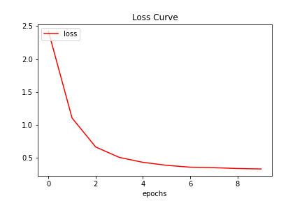
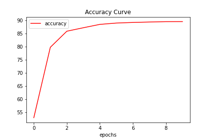
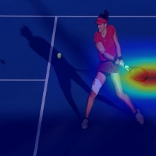

# Sports Image Classifier

## The main task

**Aim**: Our aim here is to build a sports classifier. Instead of directly implementing a standard CNN model to extract features and subsequently classify them, I used a single shot classifier which requires minimal or very less finetuning steps to perform the given downstream task. Further, I also use class activation maps to get some idea on the decisions taken by the model in classifying the images.

**Datasets used**: For pretraining: [Flickr8k dataset](https://www.kaggle.com/ming666/flicker8k-dataset), For finetuning: [Sports dataset](https://www.kaggle.com/c/logical-rythm-2k20-sports-image-classification/overview)

**Model Implemented**: CLIP (Contrastive Language-Image Pre-Training) is a neural network which can be trained on a variety of (image, text) pairs. This model was proposed by OpenAI. For more information, refer to their [repository](https://github.com/openai/CLIP)

**Framework used**: Majorly PyTorch, find some helpful [tutorials](https://pytorch.org/tutorials/beginner/deep_learning_60min_blitz.html) on how to get started with PyTorch

**Visualizations**: The visualizations or understanding of the model's outputs are done using GradCAM, which produces Class Activation Maps. [Here](https://arxiv.org/abs/1610.02391) is more information on it.

**Insights and Ablations**: The following insights are presented:
1. Zero Shot capabilities
2. Finetuning accuracies with only a subset of the dataset
3. Class activation maps to understand more on the decision taken by the Neural Network

**Find my interactive notebook here**: 

### Why did I choose CLIP and what is so interesting about it?

The model CLIP was introduced in the paper [Learning Transferable Visual Models From Natural Language Supervision paper](https://arxiv.org/abs/2103.00020). This model is very interesting because, it learns the relationship between a whole sentence and the image it describes. This is useful for image retrieval tasks i.e when the model is trained, given an input sentence it will be able to retrieve the most related images corresponding to that sentence. 

#### Why is it so interesting?
The authors show that when this model is trained on a huge dataset of images and their corresponding captions describing them, it can also act as a classifier too. They claim that, CLIP model trained with this strategy classifies ImageNet better than those SOTA models trained on the ImageNet itself optimized for the only task of classification and without using any of the 1.28 million examples that it was trained on.

### Results
The below graph is the loss curve for the finetuning task.

The below graph is the accuracy curve for the finetuning task.

The below image is the output from the GradCAM module after the finetuning task. For more information, refer to the project report in this repository.

